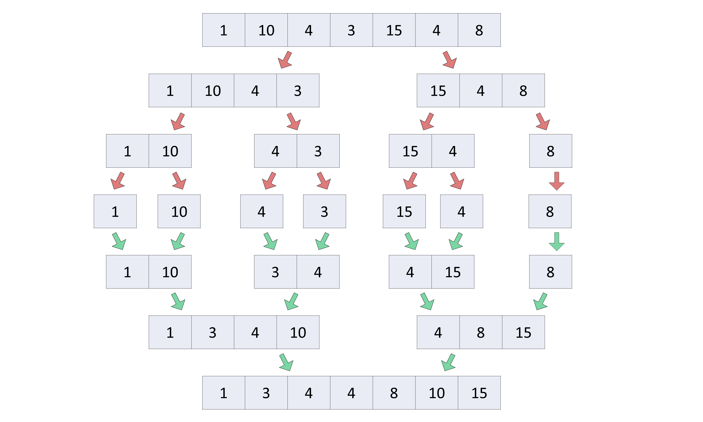
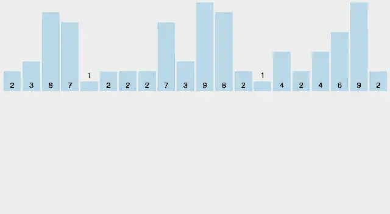

# Data Structures & Algorithms using JS

## Sliding Window

- The Sliding Window Algorithm is a technique used to solve problems that involve arrays or strings where we need to find a certain sub-array or substring that satisfies certain conditions

- The basic idea behind the sliding window technique is to transform two nested loops into a single loop.

## Divide and Conquer Algorithm

- It breaks the problem into parts, then solves each part and after that again merges the solved subtasks to get the actual problem solved.
- To use the divide and conquer algorithm, **recursion** is used.

  - **Divide**: Break the given problem into sub-problems of same type.
  - **Conquer**: Recursively solve these sub-problems
  - **Combine**: Appropriately combine the answers

- Time Complexity :-

  ```txt
    T(n) = aT(n/b) + f(n),
    where,
    n = size of input
    a = number of sub-problems in the recursion
    n/b = size of each subproblem. All sub-problems are assumed to have the same size.
    f(n) = cost of the work done outside the recursive call, which includes the cost of dividing the problem and cost of merging the solutions
  ```

- Divide and Conquer Applications
  - Binary Search O(log n)
  - Merge Sort O(n log n)
  - Quick Sort O(n log n)

We will sort an array using the divide and conquer approach (ie. merge sort).


---


---

## Recursion

- 

## Dynamic Programming "DP"

- DP approach is similar to divide and conquer in breaking down the problem into smaller
- But unlike, divide and conquer, these sub-problems are not solved independently.

- Rather, results of these smaller sub-problems are remembered and used for similar or overlapping sub-problems.

- DP used to solve problems by breaking them down into smaller sub-problems and storing the solutions to these sub-problems so that they can be reused as needed.

- Dynamic Programming is mainly an optimization over plain recursion

  

## Brute Force Algorithms

- A brute force approach is an approach that finds all the possible solutions to find a satisfactory solution to a given problem.

## Searching Algorithms

### Linear Search

- Linear search is a sequential searching algorithm where we start from one end and check every element of the list until the desired element is found

- It is the simplest searching algorithm.

- How Linear Search Works ?

```js
const linearSearch = function (arr, k) {
  for (let i = 0; i < arr.length; i++) {
    if (arr[i] == k) return i;
  }
  return -1;
};
Time Complexity :- O(n)
```

  

  

---

### Binary Search

- Binary Search is a searching algorithm for finding an element's position in a **sorted array**.

- In this approach, the element is always searched in **the middle of a portion of an array.**

Binary Search Algorithm can be implemented in two ways :-

- Iterative Method

  ```js
  const binarySearch = function (arr, k) {
    let start = 0;
    let end = arr.length;

    while (start <= end) {
      const middle = Math.floor((start + end) / 2);

      if (arr[middle] == k) return middle;

      if (arr[middle] > k) {
        end = middle - 1;
      } else {
        start = middle + 1;
      }
    }
    return -1;
  };
  Time complexity :- O(log n)
  ```

- Recursive Method :- follows the divide and conquer approach.

  ```js
  const binarySearchRecursive = function (
    arr,
    target,
    start = 0,
    end = arr.length - 1
  ) {
    if (start > end) return -1;

    const mid = Math.floor((start + end) / 2);

    if (arr[mid] === target) return mid;

    if (arr[mid] > target) {
      return binarySearchRecursive(arr, target, start, mid - 1);
    } else {
      return binarySearchRecursive(arr, target, mid + 1, end);
    }
  };
  Time complexity :- O(log n)
  ```

  

### Interpolation Search

- An Interpolation Search is an improvement over Binary Search for scenarios where the values in a sorted array are uniformly distributed.

- Interpolation Search may go to different locations according to the value of the key being searched

---

## Sorting Algorithms

### Bubble Sort

- Bubble Sort is **the simplest sorting algorithm** that works by repeatedly swapping the adjacent elements if they are in the wrong order

- This algorithm **is not suitable** for large data sets as its average and worst-case time complexity is quite high.

Here's how the algorithm works:

- Start at the beginning of the list.
- Compare the first two elements. If the first is greater than the second, swap them.
- Move to the next pair of elements (i.e. elements 2 and 3) and repeat step 2.
- Continue this process until the end of the list is reached.
- If any swaps were made in steps 2-4, repeat the whole process again from the beginning until no more swaps are needed.

> عملية التبادل تتم بحيث يتم مقارنة العنصر الحالي مع العنصر التالي في القائمة والتبادل بينهما إذا كان العنصر الحالي أكبر من العنصر التالي.

```js
  const bubbleSort = function (arr) {
    let swapped;

    do{
      swapped = false;
      for(let i = 0; i < arr.length; i++) {

        if(arr[i] > arr[i + 1]) {
          [arr[i], arr[i + 1]] = [arr[i+1],arr[i]];
          swapped = true;
        }
      }
    }while(swapped)
  }
Time complexity :- O(n^2)
```

```js
const bubbleSort = function (arr) {
  for (let i = 0; i < arr.length; i++) {
    for (j = 0; j < arr.length - i - 1; j++) {
      if (arr[i] > arr[j + 1]) {
        [arr[j], arr[j + 1]] = [arr[j + 1], arr[j]];
      }
    }
  }
};
Time complexity :- O(n^2)
```

## 

---

### Insertion Sort

- Insertion sort is a sorting algorithm that places an unsorted element **at its suitable place in each iteration.**

- Insertion sort is a sorting algorithm that places an unsorted element at its suitable place in each iteration.

- The sorting process involves inserting each element of the array into its appropriate position by checking and comparing it with the previous elements in the array.

Here's how the algorithm works:

- Start with the second element of the array (or list).
- Compare the second element with the first element. If the second element is smaller, swap them.
- Move to the third element. Compare it with the second element, and swap them if necessary to put the third element in the correct position relative to the first two.

> تعمل عن طريق إدراج العناصر غير المرتبة تدريجيًا في الجزء المرتب من القائمة. يتم البدء بالجزء الأول من القائمة ويتم الفرز حتى النهاية. يتم تحديد العنصر الذي يتم إدراجه في الجزء المرتب من القائمة ويتم إدراجه في المكان الصحيح

```js
const insertionSort = (arr) => {
  for (let i = 0; i < arr.length; i++) {
    let key = arr[i];
    let j = i - 1;

    while (j >= 0 && arr[j] > key) {
      arr[j + 1] = arr[j];
      j--;
    }
    arr[j + 1] = key;
  }
  return arr;
};
Time Complexity: O(n^2)
```


---

### Selection Sort

- That works by repeatedly finding the minimum element from an unsorted part of the array and placing it at the beginning of the sorted part of the array

Here's how the algorithm works:

- Find the smallest element in the unsorted part of the array.
- Swap the smallest element with the first element in the unsorted part of the array.
- Move the boundary between the sorted and unsorted parts of the array one element to the right.
- Repeat steps 1-3 until the entire array is sorted.

> يبدأ البحث عن أصغر رقم في المصفوفة الغير مرتبة ويضعه في بداية المصفوفه . ثم يبحث عن اقل رقم ويضعة في نهاية المصفوقه المرتبة

```js
  const selectionSort = function(arr) {
  const n = arr.length;
  for (let i = 0; i < n - 1; i++) {
    let minIndex = i;

    for (let j = i + 1; j < n; j++) {
      if (arr[j] < arr[minIndex]) {
        minIndex = j;
      }
    }
    if (minIndex !== i) {
      [arr[i], arr[minIndex]] = [arr[minIndex], arr[i]];
    }
  }
  return arr;
}
Time Complexity: O(n^2)
```


---

### Merge Sort

- Merge Sort is one of the most popular sorting algorithms that is based on the principle of **Divide and Conquer Algorithm**.

- That works by dividing an array into smaller sub-arrays, sorting each sub-arrays, and then merging the sorted sub-arrays back together to form the final sorted array.

These are the steps involved in the Merge Sort algorithm:

- The list to be sorted is identified.
- The list is divided into two equal halves.
- The previous step is repeated on the sub-lists until sub-lists containing one or fewer elements are obtained.
- The sub-lists are merged using the merge operation, where the elements in the sub-lists are compared and placed in the final list in the correct order.
- The previous step is repeated until the fully sorted list is obtained.

```js
  const mergeSort = (arr) => {
    if(arr.length < 2) return arr;

    mid = math.floor(arr.length /2)
    leftArr = arr.slice(0,mid)
    rightArr = arr.slice(mid);

    return merge(merSort(leftArr),mergeSort(rightArr))
  }

  const merge = (lefArr,rightArr) => {
    sortArray = []

    while(leftArr.length && rightArr.length) {
      if(leftArr[0] <= right[0]) {
        sortArray.push(leftArr.shift())
      }else {
        sortArray.push(rightArr.shift())
      }
    }
    return [...sortArray,...leftArr,...rightArr]
  }

  Time complexity :- O(n log n)
```



---

### Quick Sort

- **Quick Sort** is a divide-and-conquer algorithm that works by selecting a pivot element from the array and partitioning the other elements into two sub-arrays,

- According to whether they are less than or greater than the pivot. The sub-arrays are then sorted recursively.

Here are the steps for implementing Quick Sort:

- **Choose a pivot**: Choose an element, called the pivot, from the array.
- **Partition the array**: Partition the other elements into two sub-arrays, according to whether they are less than or greater than the pivot.
- **Recursively sort the sub-arrays**: Apply Quick Sort recursively to the sub-arrays created by the partition step.
- **Combine the sub-arrays**: Concatenate the two sorted sub-arrays and the pivot to form the final sorted array.

```js
[35, 33, 42, 10, 14, 19, 27, 44, 26, "31"]
[10, 14, 19, 27, "26"]`31`[35, 33, 42, "44"]
[10, 14, "19"]`26`[27]`31`[35, 33, "42"]`44`
[10, "14"]`19``26``27``31`[35, "33"]
`42``44`[10]`14``19``26``27``31``33`[35]`42``44`
[10, 14, 19, 26, 27, 31, 33, 35, 42, 44];

  const quickSort = (arr) => {
    if(arr.length < 2) return arr;

    let pivot = arr.length -1;
    let left = [];
    let right = [];

    for(let i = 0; i < arr.length -1; i++) {
      if(arr[i] < arr[pivot]) {
        left.push(arr[i]);
      }else {
        right.push(arr[i]);
      }
    }
    return [...quickSort(left),arr[pivot],quickSort(right)]
  }

Time Complexity:
  worst:- O(n^2),
  average:- O(n log n)

Space Complexity:- O(log n)
```

### Count Sort

- that sorts the elements of an array by counting the number of occurrences of each unique element in the array.

- The count is stored in an auxiliary array and the sorting is done by mapping the count as an index of the auxiliary array.

Here are the steps of the Counting Sort algorithm:

- Find the maximum value in the array to be sorted.
- Create an array count of size max + 1 and initialize all elements to 0.
- Iterate over the input array, and for each element x, increment the corresponding count in the count array.
- Modify the count array by setting each element to the sum of the current element and the previous element.
- Initialize a new output array sorted with the same length as the input array.
- Iterate over the input array in reverse order, and for each element x, use the count array to determine its sorted position in the sorted array. Decrement the count of the corresponding element in the count array.
- Return the sorted array.



```js
var countingSort = function (nums) {
  // Create the counting hash map.
  let counts = {};
  // Find the minimum and maximum values in the array.
  let minVal = Math.min(...nums);
  let maxVal = Math.max(...nums);

  // Update element's count in the hash map.
  nums.forEach((val) => {
    if (counts[val] == undefined) {
      counts[val] = 0;
    }
    counts[val] += 1;
  });

  let index = 0;
  // Place each element in its correct position in the array.
  for (let val = minVal; val <= maxVal; val += 1) {
    // Append all 'val's together if they exist.
    while (counts[val] > 0) {
      nums[index] = val;
      index += 1;
      counts[val] -= 1;
    }
  }
  return nums;
};
Time complexity:- O(n + k)
  n = the size of the input array
  k =  the range of values in the array
Space complexity:- O(n)
```

### Heap Sort

-

-

-

```js

```

### Radix Sort

- that sorts the elements by first grouping the individual digits of the same place value,

- The radix sort algorithm works by sorting the input data one digit at a time

Here are the steps of the radix sort algorithm :-

- Find the maximum number in the array.
- Determine the number of digits in the maximum number.
- For each digit position (starting from the least significant digit), sort the numbers by that digit using a stable sorting algorithm (such as counting sort).
- Combine the sorted digits to form the final sorted sequence.

for Example : `[121, 432, 564, 23, 1, 45, 788]`


```js

```
